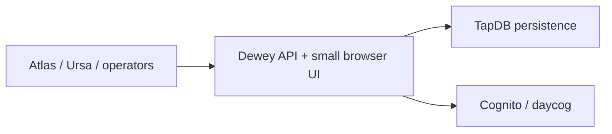

[](https://github.com/Daylily-Informatics/dewey/releases)
[](https://github.com/Daylily-Informatics/dewey/tags)
[](https://github.com/Daylily-Informatics/dewey/actions/workflows/ci.yml)

# Dewey

Dewey is the canonical artifact registry and artifact-resolution service for the stack. It gives analysis and delivery systems a stable place to register artifact identity, sets, share references, and links to external objects without handing artifact authority to the portal or the lab system.

Dewey owns:
- artifact identity and artifact metadata
- artifact-set identity and membership
- artifact resolution and storage metadata lookup
- share-reference issuance
- external object links to artifacts and artifact sets

Dewey does not own:
- customer release visibility decisions
- Atlas storage policy authority
- wet-lab or analysis execution state

## Component View



## Prerequisites

- Python 3.11+
- local PostgreSQL/TapDB-compatible runtime
- HTTPS certificates for the normal local path
- optional Cognito setup for the browser UI

## Getting Started

### Quickstart

```bash
source ./activate <deploy-name>
dewey config init
dewey db build --target local
dewey server start --port 8914
```

HTTPS is the expected local posture. Place certs at `certs/cert.pem` and `certs/key.pem` before starting the normal local server flow.

## Architecture

### Technology

- FastAPI + Jinja2
- Typer-based `dewey` CLI
- TapDB-backed persistence
- Cognito-backed browser auth

### Core Object Model

Dewey centers on:

- artifacts
- artifact sets
- external objects and external-object relations
- share references
- resolution requests that map identifiers to storage metadata

### Runtime Shape

- app factory: `dewey_service.app:create_app`
- CLI: `dewey`
- main CLI groups: `server`, `db`, `config`, `env`, `test`, `quality`

### API Shape

Current major route groups include:

- artifact registration and lookup under `/api/v1/artifacts`
- artifact-set registration and membership under `/api/v1/artifact-sets`
- resolution flows under `/api/v1/resolve/*`
- share references and external-object relations under `/api/v1/*`

The browser UI is intentionally narrow and focused on search, anomalies, observability, and literature-oriented workflows.

## Cost Estimates

Approximate only.

- Local development: workstation plus local database.
- Shared sandbox: generally a modest portion of the broader Dayhoff-managed service footprint.
- Production-like environments cost more because registry availability, storage metadata, TLS, and database uptime matter more than the Dewey code itself.

## Development Notes

- Canonical local entry path: `source ./activate <deploy-name>`
- Use `dewey ...` for Dewey-owned operations
- Use `tapdb ...` for shared DB/runtime lifecycle when Dewey explicitly delegates it
- Use `daycog ...` for shared Cognito lifecycle when Dewey explicitly delegates it
- `dewey db reset --target local` deletes the current local TapDB target and rebuilds it
- `dewey db nuke --target local` deletes the current local TapDB target without rebuilding

Useful checks:

```bash
source ./activate <deploy-name>
dewey --help
pytest -q
```

## Sandboxing

- Safe: docs work, tests, `dewey --help`, and local-only runtime checks
- Local-stateful: `dewey db build --target local`
- Requires extra care: HTTPS cert management, Cognito lifecycle, and any deployed environment integration

## Current Docs

- [Docs index](docs/README.md)

## References

- [FastAPI](https://fastapi.tiangolo.com/)
- [TapDB](https://github.com/Daylily-Informatics/daylily-tapdb)
- [daylily-cognito](https://github.com/Daylily-Informatics/daylily-cognito)
