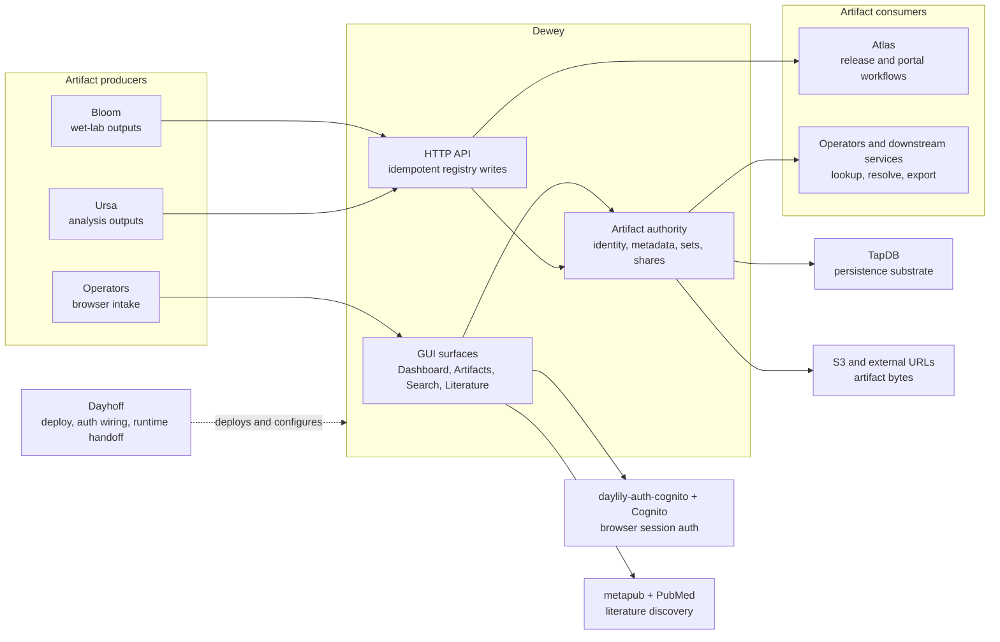

# Dewey

Dewey is the Daylily artifact registry and artifact-resolution service. It gives operators a browser console for registering, searching, grouping, and sharing artifacts, while giving other services a stable HTTP contract for artifact identity, metadata, and location.

For most GUI users, the short version is:

- Dewey is where the platform knows that a digital artifact exists.
- Dewey can point at existing S3 objects, copy/import them, or accept uploaded files into managed storage.
- Dewey can group artifacts into named sets, attach external links, issue share references, and save literature records discovered through PubMed.

Current live caveat: local-file uploads and copy-style imports depend on a configured managed artifact bucket. S3 `reference` intake can still work without that bucket when Dewey can read the source object.

Dewey's Cognito integration now uses `daylily-auth-cognito` 2.0 as a split boundary: browser session helpers live in `browser.session`, Hosted UI helpers live in `browser.oauth` and `browser.google`, bearer verification lives in `runtime.verifier` and `runtime.m2m`, and lifecycle changes stay in `daycog` via `admin.*`. Service runtime code should not import `daylily_auth_cognito.cli`.

## What Dewey Does Today

Dewey currently owns:

- artifact identity through Dewey EUIDs
- artifact registry metadata, including typed browser fields and freeform JSON metadata
- artifact-set identity and membership
- artifact lookup and resolution
- share-reference issuance and lookup
- external object records and external-object relations
- literature saves, including visibility metadata and optional managed PDF copies

Dewey currently does not own:

- wet-lab workflow or specimen truth
- analysis execution truth
- customer release authority
- cross-service workflow orchestration
- a public event or message-bus API

## Common User Tasks

From the GUI, Dewey supports these concrete workflows today:

- quick register a local file, public URL, or S3 URI from the dashboard
- use the full Artifacts surface for register/upload, directory intake, S3 prefix intake, bulk TSV intake, ZIP download, link generation, and artifact-set creation
- search artifacts and share references from Unified Search and export JSON or TSV
- search PubMed and save literature into Dewey as managed artifacts or external references
- inspect local observability and anomaly surfaces
- update the managed artifact bucket from the Admin page

## Dewey In The LIS Ecology

Dewey is one service inside the larger Dayhoff-managed LIS ecology. It is the artifact authority, not the whole application stack.



The surrounding ownership split is deliberate:

- Atlas owns customer, order, and release-facing truth.
- Bloom owns wet-lab material state and lab execution.
- Ursa owns analysis execution and review state.
- Dewey owns artifact identity and resolution.
- TapDB owns shared persistence machinery, not artifact semantics.
- Dayhoff owns deploy intent, pinning, auth/bootstrap handoff, and runtime wiring.

## Architecture, Tech Stack, And Philosophy

Dewey is currently implemented as:

- FastAPI for the HTTP surface
- Jinja2 templates plus shared CSS for the operator console
- TapDB-backed persistence through a Dewey service layer composed from mixins
- S3-backed storage helpers for registration, verification, locking, downloads, upload sessions, and presigned links
- daylily-auth-cognito for browser-session auth
- metapub for PubMed discovery and literature metadata enrichment

The governing design rules are visible in current code and nearby Dayhoff governance docs:

- one authority per entity family
- explicit cross-system references instead of shadow ownership
- idempotent write boundaries for cross-service calls
- Dewey stays registry-first and does not expand into workflow orchestration

That philosophy shows up directly in the runtime:

- write APIs persist and replay idempotent responses keyed by `Idempotency-Key`
- browser UI is thin and task-focused
- Dewey stores canonical artifact facts while leaving artifact-producing business logic to Bloom, Ursa, or operators

## Worked Examples

### Browser-first examples

1. Register a report from the dashboard.
   Use `Dashboard -> Quick Register`, choose a local file or enter a public URL or S3 URI, and submit one source at a time. Local files and copy/import flows require the managed artifact bucket to be configured first.
2. Run multi-source intake with grouping.
   Use `Artifacts -> Register`, combine local files, URLs, and S3 URIs or prefixes, then create or attach an artifact set. In a bucketless local deployment, S3 `reference` mode is the most reliable browser intake path.
3. Save a literature paper.
   Use `Literature Search`, search PubMed, review the metadata and full-text status, then choose `auto`, `managed_artifact`, or `external_reference`.
4. Export normalized results.
   Use `Unified Search`, filter the result set, then export JSON or TSV from the current query.

### HTTP examples

Register an existing S3 object:

```bash
curl -k -sS \
  -H "Authorization: Bearer $DEWEY_API_TOKEN" \
  -H "Idempotency-Key: demo-register-1" \
  -H "Content-Type: application/json" \
  https://localhost:8914/api/v1/artifacts \
  -d '{
    "artifact_type": "report",
    "storage_backend": "s3",
    "bucket": "example-bucket",
    "key": "reports/case-report.pdf",
    "original_filename": "case-report.pdf",
    "producer_system": "atlas",
    "producer_object_euid": "REL-123",
    "metadata": {
      "study_id": "STUDY-1",
      "tags": ["release", "report"]
    }
  }'
```

Import from an S3 URI in reference mode:

```bash
curl -k -sS \
  -H "Authorization: Bearer $DEWEY_API_TOKEN" \
  -H "Idempotency-Key: demo-import-1" \
  -H "Content-Type: application/json" \
  https://localhost:8914/api/v1/artifacts/import \
  -d '{
    "artifact_type": "vcf",
    "source_uri": "s3://example-bucket/releases/sample.vcf.gz",
    "import_mode": "reference",
    "producer_system": "bloom",
    "producer_object_euid": "RUN-42"
  }'
```

Query normalized search:

```bash
curl -k -sS \
  -H "Authorization: Bearer $DEWEY_API_TOKEN" \
  -H "Content-Type: application/json" \
  https://localhost:8914/api/search/v2/query \
  -d '{
    "q": "sample.vcf.gz",
    "scopes": ["artifact", "share_reference"],
    "page": 1,
    "page_size": 25
  }'
```

## Current-State Test Snapshot As Of April 6, 2026

The current measured repo state is:

- `256` collected tests
- `254` passed
- `0` failed
- `2` skipped
- `84%` total coverage for `dewey_service`

The main remaining caveat is environmental, not functional: the browser-auth and E2E paths still depend on a real Cognito configuration plus local HTTPS on `https://localhost:8914`. In a configured deployment, the current suite now verifies the GUI and auth surfaces much more cleanly than the earlier April 6 baseline.

## Technical Appendix

### Install And Activate

Use the repo-owned activation entrypoint:

```bash
source ./activate <deploy-name>
dewey --help
dewey runtime check
```

That activation flow creates or reuses a deployment-scoped conda environment like `DEWEY-local`, installs the repo editable, ensures local `daylily-tapdb` and local `daylily-auth-cognito` are available when needed, installs published `cli-core-yo==2.0.0`, and exports deployment-scoped env values such as `DEWEY_DEPLOYMENT_CODE`.

### Local Run

The current CLI-first local path is:

```bash
source ./activate <deploy-name>
dewey --json version
dewey config init
dewey db build --target local
dewey server start --port 8914
```

Current published-package note from the April 15, 2026 TapDB hard cut:

- this repo now pins the `daylily-tapdb` version declared in `pyproject.toml`
- the shared TapDB config lives at `~/.config/tapdb/dewey/dewey/tapdb-config.yaml`
- if you invoke `tapdb` manually, use that shared config path directly:

```bash
tapdb --config ~/.config/tapdb/dewey/dewey/tapdb-config.yaml --env dev db setup dev --force
```

- after a fresh `dewey config reset`, export the explicit TapDB config path when running Dewey-owned seed or server commands:

```bash
export TAPDB_CONFIG_PATH=~/.config/tapdb/dewey/dewey/tapdb-config.yaml
dewey db seed
dewey server start --port 8914
```

Useful follow-up commands:

```bash
dewey server status
dewey server logs
dewey runtime status
dewey tapdb run db status
dewey cognito status
dewey test run
dewey quality lint
```

### Deploy And Dayhoff Fit

Dewey is already a named Dayhoff-managed service role. In practice that means Dewey already exposes:

- a repo-root `activate` script
- deployment-scoped config files
- CLI-owned server and DB lifecycle commands
- health and readiness endpoints
- a routable base URL contract
- observability endpoints for Dayhoff and Kahlo to inspect

See [docs/becoming_a_discoverable_service.md](docs/becoming_a_discoverable_service.md) for the Dewey-specific contract, and consult the adjacent Dayhoff repo for the broader stack-level view.

### Contribute

Current developer checks:

```bash
source ./activate <deploy-name>
dewey --help
dewey --json version
dewey runtime check
dewey test run
dewey test cov
dewey quality check
pytest --collect-only -q
pytest --cov=dewey_service --cov-report=term-missing:skip-covered
```

`--json` is a root-global flag in the v2 CLI. Commands that do not explicitly support JSON reject it with a contract error instead of silently printing mixed output.

There is no documented artifact-specific CLI subcommand tree yet. Artifact operations are currently exposed through the browser UI and HTTP APIs, while the `dewey` CLI owns server, DB, tapdb passthrough, Cognito status, test, quality, config, env, and runtime lifecycle.

### Security Model

Dewey currently uses two main auth modes:

- bearer-token auth for the main API write/read surface
- Cognito-backed browser sessions for the GUI

Observability endpoints accept either a valid session or a valid service bearer token, while `/my_health` is session-only.

The current repo does not expose a separate public messaging or event-stream API. Historical governance docs may discuss event families conceptually, but the live implementation here is HTTP-first.

### API Index

See [docs/apis.md](docs/apis.md) for the complete current HTTP contract, including:

- health, readiness, and observability endpoints
- login/logout/session pages
- artifacts, artifact sets, share references, search, literature, and external-object APIs
- idempotency requirements
- deprecated search alias endpoints and headers

### GUI Index

See [docs/gui.md](docs/gui.md) for the current screen-by-screen guide:

- Dashboard
- Artifacts
- Literature Search
- Unified Search
- Anomalies
- Observability
- Admin

### Testing And Coverage

Current measured test facts:

- `pytest --collect-only -q` collected `256` tests on April 6, 2026
- `pytest --cov=dewey_service --cov-report=term-missing:skip-covered` measured `84%` total coverage on April 6, 2026, with `254 passed` and `2 skipped`
- the current e2e browser suite covers login/logout only and expects a real Cognito user-pool setup

The current E2E helper defaults to `https://localhost:18914`, while the Dewey config template and standard local server commands default to `https://localhost:8914`. When using the E2E flow, set `DEWEY_BASE_URL` explicitly if your running service is on the standard port.

### Curated Historical Reading

Inside this repo:

- [docs/old_docs/bloom_dewey_vs_solo_dewey_gap_report.md](docs/old_docs/bloom_dewey_vs_solo_dewey_gap_report.md)
- [docs/old_docs/dewey_cutover_execution_plan.md](docs/old_docs/dewey_cutover_execution_plan.md)
- [docs/old_docs/branch_triage_2026-04-02.md](docs/old_docs/branch_triage_2026-04-02.md)

In the adjacent Dayhoff repo:

- `../dayhoff/DESIGN_PHILOSOPHY.md`
- `../dayhoff/docs/becoming_a_discoverable_service.md`
- `../dayhoff/docs/old_docs/governance/OBJECT-OWNERSHIP-GOVERNANCE.md`

Current code wins when historical docs disagree.

## Glossary

- `artifact`: The canonical Dewey record for a file-like object, including identity, storage coordinates, metadata, and lifecycle fields.
- `artifact set`: A Dewey-owned grouping of artifacts with its own identity, metadata, and membership edges.
- `artifact EUID`: The opaque Dewey identifier for an artifact record.
- `artifact authority`: The rule that Dewey is the system of record for artifact identity and resolution.
- `availability status`: A field describing whether Dewey believes the backing object is available or missing.
- `Cognito session`: The browser-session auth mode used by the GUI.
- `external object`: A first-class Dewey record representing an object owned by another system, such as Atlas or another producer.
- `external object relation`: The Dewey relation connecting an artifact or artifact set to an external object.
- `idempotency`: The write-contract rule that repeated API requests with the same `Idempotency-Key` and payload replay the same stored result.
- `import mode`: The artifact intake mode, such as `register`, `reference`, `copy`, or `upload`.
- `literature save`: The Dewey overlay that stores per-user or shared visibility around a literature artifact discovered through PubMed.
- `managed artifact`: An artifact whose bytes are stored in Dewey-managed S3 storage rather than only referenced externally.
- `observability`: Dewey-local health, endpoint, DB, and auth rollups exposed through authenticated endpoints and UI pages.
- `producer system`: The upstream system or workflow that created or registered an artifact, such as Atlas, Bloom, Ursa, or an operator.
- `share reference`: A Dewey record describing a time-bounded sharing action for an artifact or artifact set.
- `TapDB`: The shared persistence substrate Dewey uses for templates, instances, lineage, and related storage primitives.
- `Unified Search`: Dewey's normalized search surface for artifacts, share references, and, through the API, artifact sets.
 
