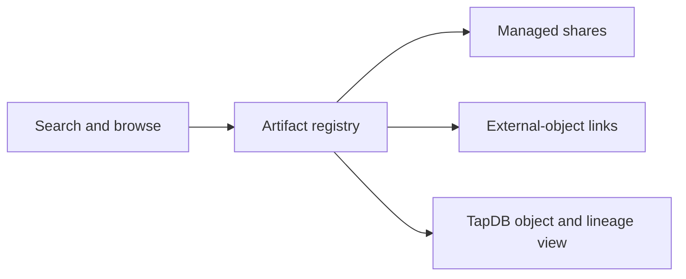

<p align="center">
  <strong>Dewey</strong><br>
  Artifact, reference, share, and external-object registry for Dayhoff.
</p>

<p align="center">
  <a href="docs/apis.md">API</a> ·
  <a href="docs/gui.md">GUI</a> ·
  <a href="docs/architecture.md">Architecture</a> ·
  <a href="docs/sequencer_run_registration.md">Run registration</a>
</p>

## Overview

Dewey is the LSMC artifact and reference registry. It tracks durable artifacts such as sequencing run directories, VCFs, reports, external objects, external-object relations, managed shares, and access routes. It is the registry layer for data products and referenceable outputs, not the laboratory material graph.

Current Dayhoff pins are maintained in `/Users/jmajor/projects/mega_dayhoff/dayhoff/services/pins.toml`. Current TapDB dependency: `daylily-tapdb @ ...@9.0.5`.

Dewey is an approved-network customer/collaborator service in Dayhoff exposure policy.



## What It Does

| Capability | Current surface |
|---|---|
| Artifact registry | CLI, GUI search/details, and `/api/v1/*` artifact routes |
| Managed shares | Durable Dewey share records with short-lived access packages, revocation, and sanitized diagnostics |
| External objects | Cross-service object references and relation records |
| TapDB substrate | Generic object, lineage, audit, template, and external-link inspection at `/tapdb` |

## How It Works

Dewey writes registry objects and share state through explicit service config and TapDB-backed storage. Delivery URLs stay lazy and managed: active shares expose stable Dewey routes, while raw presigned URLs, object keys, and storage internals are not shown to unauthorized users. CLI, GUI, and API surfaces are alternate entrypoints over that same registry/share logic where the feature is implemented.

## Quickstart

```bash
cd /Users/jmajor/projects/mega_dayhoff/repos_work/dewey
source ./activate <deploy-name>
dewey --help
dewey config init --help
dewey db build --target local
dewey server start --port 8914
```

Use explicit absolute paths for service config and TapDB config. Do not document or depend on fallback config discovery.

## CLI Interface

The primary CLI is `dewey`. It covers config initialization, local DB/bootstrap, server startup, artifact/reference operations, and operational utilities.

Common command families:

| Family | Purpose |
|---|---|
| `dewey config ...` | Create or inspect explicit runtime config. |
| `dewey db ...` | Build or verify Dewey storage state through supported paths. |
| `dewey server ...` | Start the FastAPI service. |
| `dewey artifacts ...` | Register, resolve, and inspect artifact references where exposed by CLI. |
| `dewey shares ...` | Inspect managed shares through safe routes where exposed by CLI. |

Dewey delegates low-level storage lifecycle to `tapdb` and shared Cognito lifecycle to `daycog` only where Dewey explicitly documents that delegation. CLI, API, and GUI should expose the same registry/share capabilities wherever practical.

## GUI

Dewey exposes a browser GUI for artifact search, artifact/reference details, share management, external refs, and operational workflows. The mounted TapDB GUI at `/tapdb` is used for generic object, lineage, audit, template, and external-link inspection when configured.

GUI pages must not expose raw presigned URLs, bucket keys, or sensitive storage details to unauthorized users.

## API

The primary API is under `/api/v1/*`. Current route families include artifact registration/resolve, external objects, external-object relations, shares/share roots, search, QEO handoff, and observability.

Health and observability routes follow the Dayhoff/Kahlo v3 shape: `/healthz`, `/readyz`, `/health`, `/obs_services`, `/api_health`, `/endpoint_health`, `/db_health`, `/my_health`, and `/auth_health`.

## Testing Info

Focused checks:

```bash
python -m pytest tests -q
python -m pytest tests/test_share_management.py tests/test_service_relationships.py -q
```

Deployed evidence should target `https://dewey.<deploy>.dev.lsmc.bio` and include login redirect, artifact/search pages, share behavior, TapDB pages, and external-object APIs where credentials are available.

## Technical Details, History, And Linkouts

- [`docs/README.md`](docs/README.md): Dewey docs index.
- [`docs/apis.md`](docs/apis.md): HTTP routes and auth modes.
- [`docs/gui.md`](docs/gui.md): browser surfaces.
- [`docs/architecture.md`](docs/architecture.md): domain ownership and runtime model.
- [`docs/sequencer_run_registration.md`](docs/sequencer_run_registration.md): run-directory registration.
- [`docs/qeo/`](docs/qeo/): QEO/Dewey handoff contracts.
- [`docs/old_docs/`](docs/old_docs/): historical material only.
