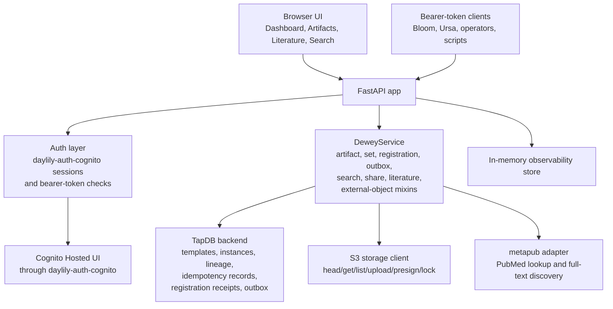

# Dewey Architecture

## Summary

Dewey is the canonical artifact registry and artifact-resolution service in the Daylily stack. Its job is not to run workflows or own every domain object. Its job is to answer a narrower set of questions well:

Dewey's Cognito integration follows the `daylily-auth-cognito` 2.0 split: browser sessions live in `browser.session`, Hosted UI helpers live in `browser.oauth` and `browser.google`, bearer verification lives in `runtime.verifier` and `runtime.m2m`, and lifecycle changes stay in `daycog` via `admin.*`. Service runtime code should not import `daylily_auth_cognito.cli`.

- what artifact exists
- what its stable Dewey identity is
- where the bytes live
- how that artifact is grouped, shared, and cross-linked
- what literature records have been saved into Dewey

## Domain Model

The current domain model is visible in the FastAPI surface, service layer, and TapDB template usage.

### Artifact

An artifact record currently carries:

- `artifact_euid`
- `artifact_type`
- storage coordinates such as backend, bucket, key, version, and derived `storage_uri`
- origin metadata such as `producer_system` and `producer_object_euid`
- lifecycle fields such as `storage_status`, `availability_status`, and retention metadata
- freeform `metadata`

Browser-supported artifact metadata fields are currently:

- `title`
- `sample_id`
- `study_id`
- `assay`
- `pipeline`
- `recorded_at`
- `tags`
- `notes`

The browser also accepts extra JSON metadata, so the structured fields are a starting convention rather than the whole schema.

### Artifact Set

Artifact sets are Dewey-owned groupings of artifacts. Current browser-supported set metadata fields are:

- `program`
- `cohort`
- `release_label`
- `recorded_at`
- `tags`
- `notes`

Current browser artifact-set types are:

- `analysis_output`
- `batch`
- `collection`
- `delivery`
- `release`

### Share Reference

Share references describe a sharing action for an artifact or artifact set. Current live behavior includes:

- target type and target EUID
- purpose and scope
- start and expiry
- transport metadata
- concrete presigned URLs for S3-backed shares where available
- manifest rows for artifact-set sharing

Artifact shares currently require `presigned_s3`. Artifact-set shares support `presigned_s3`, `rclone_http`, and `rclone_sftp`.

### External Object And Relation

External objects let Dewey model links to records owned elsewhere, such as Atlas documents or other system-specific IDs. External-object relations attach those records to artifacts or artifact sets without turning Dewey into the semantic owner of the external system.

### Literature Save Overlay

Literature records are represented as artifacts with `artifact_type == "literature"`, then enriched by a separate literature-save layer that stores:

- owner subject
- visibility scope
- allowed users
- allowed groups
- saved-by-me and saved-by-others projections used in search and the literature UI

## Runtime Shape

The current application boot path lives in `dewey_service.app:create_app`.

At startup, Dewey wires together:

- FastAPI app and route surface
- a `DeweyService` composed from artifact, artifact-set, QEO/KEO registration, outbox, search, literature, sharing, and external-object mixins
- a TapDB backend for persistence
- an S3 storage client for object inspection, upload sessions, downloads, locking, and presigned URLs
- a `MetapubAdapter` for PubMed search and record retrieval when available
- a Cognito web-session config via `daylily-auth-cognito`
- an in-memory observability store for request, DB, and auth rollups

## Public Surfaces

### Browser UI

The current GUI is split across these main pages:

- `/ui`
- `/artifacts`
- `/literature`
- `/search`
- `/ui/anomalies`
- `/ui/observability`
- `/admin`

This is a task-focused operator console, not a broad end-user application.

### HTTP API

The API surface is grouped into:

- health and observability endpoints
- artifacts
- artifact sets
- share references
- resolution endpoints
- literature endpoints
- search endpoints
- external objects and relations

Write operations are intentionally idempotent and generally require `Idempotency-Key`.

## Auth Model

The current auth split is explicit in code:

- bearer token auth for the main `/api/v1/*` registry surface
- Cognito-backed browser sessions for GUI pages
- either bearer token or valid session for most observability endpoints
- session-only access for `/my_health`
- admin-session requirement for `/admin`

Current role values are:

- `READ_ONLY`
- `READ_WRITE`
- `ADMIN`

Current default Cognito group mappings are:

- `platform-admin -> ADMIN`
- `dewey-admin -> ADMIN`
- `dewey-readwrite -> READ_WRITE`
- `dewey-readonly -> READ_ONLY`

## Storage Behavior

Dewey is designed for artifacts that already live in S3, but current code also supports direct upload and URL-backed download behavior through the GUI and API.

Implemented storage behaviors include:

- register an existing S3 object
- import from `s3://` URI in `reference` or `copy` mode
- expand S3 prefixes
- create upload sessions for managed storage
- complete uploads into managed storage
- verify artifact storage
- apply retention locks
- generate presigned download URLs
- build ZIP downloads with companion `.dewey.yaml` metadata files in the browser flow

This is broader than a pure metadata catalog, but it is still bounded by artifact ownership, not end-to-end workflow ownership.

## Search Behavior

Current search is split between:

- Unified Search for normalized search across artifacts and share references, and artifact sets through the API
- the dedicated Artifacts page for register/upload/download/set workflows and more detailed artifact-set actions

Current live search behavior includes:

- text query over names, IDs, metadata, storage URIs, literature fields, and external-object projections
- property filters over fields and nested metadata
- created-at range filters
- JSON and TSV export

## Observability

Dewey also ships service-local observability features:

- `/healthz` and `/readyz`
- authenticated health rollups under `/health`, `/obs_services`, `/api_health`, `/endpoint_health`, `/db_health`, `/my_health`, and `/auth_health`
- local anomaly records exposed through API and UI views

These are Dewey-local operational views, not a general platform observability backend.

## Ownership Boundaries

### What Dewey Owns

Current Dewey ownership aligns with the adjacent Dayhoff governance docs:

- artifact identity
- artifact registration
- artifact grouping
- artifact registry metadata
- artifact lookup and resolution

### What Dewey Does Not Own

Current code and docs do not support claims that Dewey owns:

- workflow orchestration
- wet-lab truth
- analysis truth
- customer release authority
- a public messaging/event API

The QEO/KEO registration path adds a local transactional outbox for internal
handoff evidence. It is persisted in TapDB and is not exposed as a public event
stream.

### Relation To Other Services

- Bloom can produce artifacts and register them with Dewey, but Bloom is not the artifact registry.
- Ursa can resolve and register analysis artifacts, but Ursa is not the artifact registry.
- Atlas can consume Dewey artifact references, but Atlas is not the artifact registry.
- TapDB persists Dewey objects, but TapDB is not the semantic owner.
- Dayhoff deploys and wires Dewey into the stack, but Dayhoff does not own Dewey's domain behavior.

## Current-State Caveat

The architecture described here is grounded in live code and current tests. In the current April 6, 2026 verification run, the repo measured `256` collected tests with `254 passed`, `2 skipped`, and `84%` coverage. The main remaining caveat is that browser-auth verification still depends on a configured Cognito deployment and the local HTTPS surface being available.
