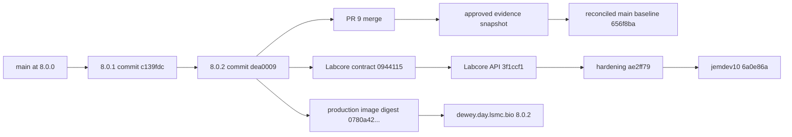
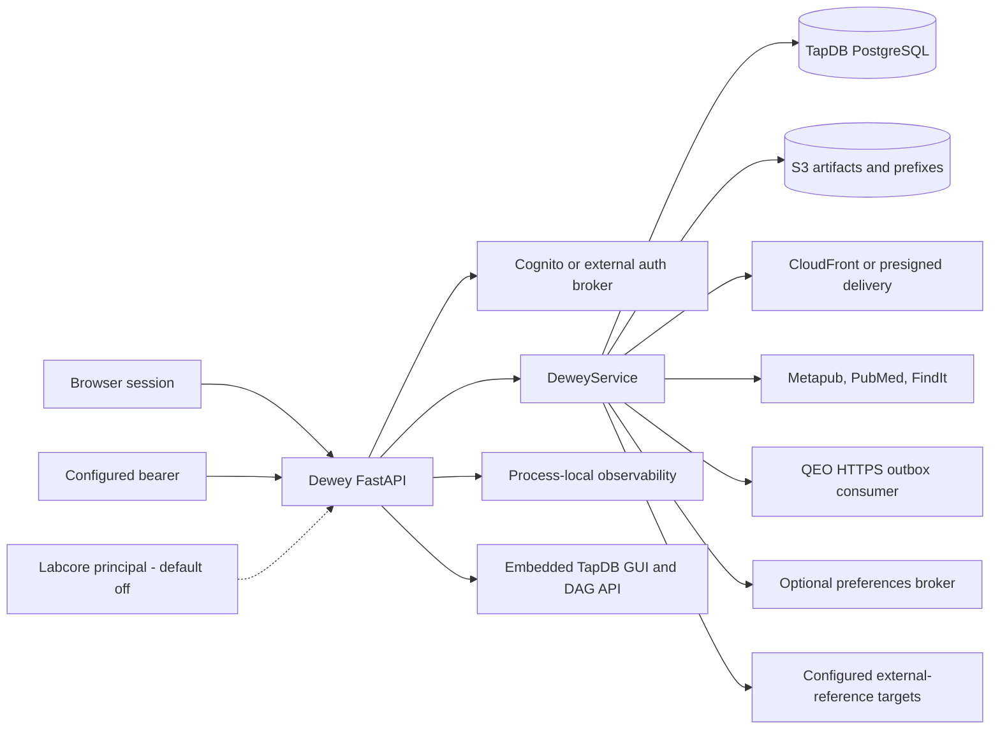
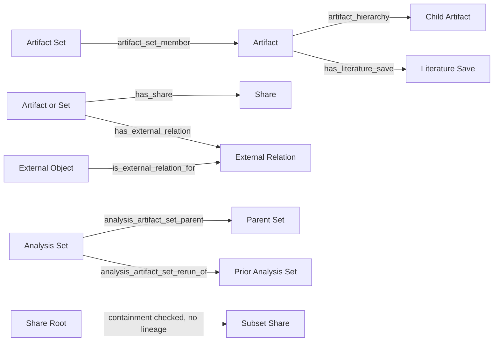

# Dewey Derived Features And Capabilities

Evidence cutoff: 2026-09-01

## Purpose And Claim Boundary

This document is a source-derived reference for Dewey product planning. It
describes what the production service, released source, repository-only source,
and retained local work actually provide; it does not treat a route, test, or
documentation statement as proof of successful production use.

The authoritative production source is annotated tag `8.0.2`, commit
`dea0009b743ad5b627177acdf21c87dd5c1d67c1`. The production container's
application and build-input bytes match that tag. Authoritative `main` now
contains those production commits plus an evidence-only template inventory.
The repository default branch, `jemdev10`, additionally contains a default-off
Labcore owner-registration lane that is not deployed.

Status terms used below:

| Status | Meaning |
| --- | --- |
| `live-proven` | A read-only production check proved the named surface or runtime fact. It does not imply every workflow on that surface was exercised. |
| `implemented-not-live-proven` | Released or repository source implements the behavior, but this audit did not complete a production mutation/use proof. |
| `local-only` | The behavior exists only in an unmerged local candidate. |
| `broken/suspect` | Source evidence shows a broken invariant, unsafe semantic, or a material mismatch requiring correction or explicit acceptance. |
| `redundant` | Two surfaces or models overlap without a clear independent contract. |
| `deprecated` | Source or documentation marks the surface obsolete. |
| `misleading` | The name, documentation, response, or UI implies behavior that is not actually provided. |
| `hidden` | Implemented behavior is absent or materially incomplete in normal navigation, shipped configuration, or primary documentation. |
| `not implemented` | The capability is outside the current service or is advertised but absent. |

## Executive View

Dewey is a FastAPI service for durable artifact, artifact-set, lineage,
registration, external-reference, literature-save, search, sharing, and
delivery metadata. TapDB provides typed objects, business identifiers, lineage,
audits, receipts, and outbox persistence. S3 provides managed or referenced
artifact storage. Dewey also embeds TapDB's GUI/DAG surface and integrates with
Cognito or an external browser-auth broker, QEO HTTP dispatch, CloudFront,
PubMed/Metapub/FindIt, and an optional preferences broker.

Dewey is not a workflow engine, scientific-results interpreter, object-content
integrity service, public anonymous file portal, or automatic cross-service
relationship discoverer. Its strongest current contracts are strict analysis
and MultiQC artifact-set registration. Its largest release-quality gaps are
authorization boundaries, event dispatch consistency, mutability after
receipt-backed registration, fail-open validation/import behavior, and
documentation drift.

## Provenance And Deployment State

| State | Identity | Evidence | Status |
| --- | --- | --- | --- |
| Production service | `dewey.day.lsmc.bio`, version `8.0.2` | `/healthz` and `/readyz` returned `200`; database probe was ready | `live-proven` |
| Production image | `sha256:0780a42dd2b3d5620de2c538cada32acd661f5be5a0f0b60a08c9f941ea3af42` | Active Compose/container reference and release manifest agree | `live-proven` |
| Production source | annotated `8.0.2` at `dea0009` | Every Dockerfile-copied application/build-input file is byte-identical | `live-proven` |
| Reconciled main baseline | `656f8ba15847917c4ddd8781a6a2fc2a781a041b` before this documentation branch | Contains original `8.0.1`/`8.0.2` commits and approved evidence-only snapshot | `implemented-not-live-proven` with production-equivalent behavior |
| Repository default | `jemdev10` at `6a0e86a14798997f22daa2aa381ba2946fd15766` | Adds default-off Labcore contract/API and two reviewed hardening fixes | `implemented-not-live-proven` |
| Local share-view candidate | unmerged worktree based on `8.0.0` | Adds a stateful share redirect and inherits known authorization gaps | `local-only`, deferred |

Production runs Dewey `8.0.2`, Python `3.12.13`, TapDB `9.0.9`,
auth-cognito `2.1.5`, cli-core-yo `2.1.1`, FastAPI `0.136.3`, Uvicorn
`0.48.0`, and boto3 `1.43.15`. The image declares user `lsmc`, but Compose
overrides it with `0:0`; the live service process therefore runs as root.
Release SHA and OCI source/revision metadata are absent from the running image.

## Runtime And Service Boundaries

Startup fails closed when the required AWS profile, absolute TapDB
configuration, deployment configuration, or runtime dependencies are absent.
TapDB persistence is PostgreSQL-backed for local, Compose, and Aurora targets.
The production container runs one Uvicorn process; observability data is
in-memory and process-local.

## Durable Object And Lineage Model

Dewey registers eleven app-owned TapDB templates. All released instances use
the shared Dewey `DGX` instance prefix and domain `Z`.

| Object family | Template code | Purpose | Status |
| --- | --- | --- | --- |
| Artifact | `data/artifact/generic/1.0/` | Object or prefix identity, storage coordinates, producer and metadata | `implemented-not-live-proven` |
| Artifact Set | `data/artifact_set/generic/1.0/` | Named collection and strict registration root | `implemented-not-live-proven` |
| Share | `access/share/generic/1.0/` | Recipient policy, target, delivery mode, expiry, audit summary | `implemented-not-live-proven`; authorization findings apply |
| Share Root | `access/share_root/generic/1.0/` | Prefix boundary for subset shares | `implemented-not-live-proven`; missing durable subset lineage |
| External Object | `integration/external_object/generic/1.0/` | Foreign-system object identity | `implemented-not-live-proven`; overlaps TapDB XRF |
| External Object Relation | `integration/external_object_relation/generic/1.0/` | Reified attachment between a local target and external object | `implemented-not-live-proven`; overlaps direct-lineage pattern |
| Literature Save | `access/literature_save/generic/1.0/` | User-owned literature overlay and visibility policy | `implemented-not-live-proven` |
| Anomaly | `operational/anomaly/generic/1.0/` | Operational anomaly record | `misleading`; released bootstrap records are static demos |
| Idempotency Request | `system/idempotency_request/generic/1.0/` | Durable mutation fingerprint and replay response | `implemented-not-live-proven` |
| Registration Receipt | `system/registration_receipt/generic/1.0/` | Immutable registration evidence and response identity | `implemented-not-live-proven` |
| Outbox Event | `system/outbox_event/generic/1.0/` | Deferred integration event | `implemented-not-live-proven`; some event families are undispatchable |

TapDB separately ships the typed external-reference template
`reference/external_identifier/tapdb_object/1.0/` with prefix `XRF`. The
preferred future rule is XRF plus direct lineage for ordinary external
identity. A reified relation object is justified only when the relationship
itself has independent metadata, authorization, audit, receipt, or lifecycle.
The current Labcore lane retains Dewey's existing model to avoid a one-feature
migration or dual-write pattern. This representation choice is separate from
identity uniqueness: TapDB `#93` proposes an optional database-enforced
typed-instance identity key that can protect either the current Dewey external
object or a future XRF object without making JSON fields the uniqueness
authority.

## Capability-To-Surface Matrix

| Capability family | GUI | API | CLI | Durable/storage effects | Primary auth | Status |
| --- | --- | --- | --- | --- | --- | --- |
| Artifact register/import/prefix | dashboard and artifact forms | `/api/v1/artifacts*`, `/api/v1/artifact-prefixes` | none | Artifact objects; optional S3 copy/lock | session for GUI; broad bearer for API | `implemented-not-live-proven` |
| Upload and storage | artifact pages and download forms | upload session, browse, verify, lock, download-related routes | none | S3 object metadata, signed URLs, optional governance retention | session or bearer by route | `implemented-not-live-proven`; integrity wording is misleading |
| Artifact sets | set create/search/export/share forms | set CRUD, membership, resolve | none | Set objects and membership lineage | session or bearer | `implemented-not-live-proven`; registered-set mutability is broken |
| Analysis/MultiQC registration | no dedicated primary GUI | strict registration APIs | none | Set, artifacts, lineage, receipt, idempotency, outbox | broad bearer | `implemented-not-live-proven`; comparatively strong contract |
| Sequencer run/results | browser sequencer form | sequencer-run and analysis-result registration | none | Artifacts, sets, manifests, receipts, outbox | session or bearer | `implemented-not-live-proven`; dispatch field mismatch |
| Search/export | search pages | `/api/search/v2/*` | none | read/query; export response only | session or bearer | `implemented-not-live-proven`; truncation/fail-open findings |
| Shares/roots/subsets | share manager and artifact/set forms | `/api/v1/shares*`, `/api/v1/share-roots*` | none | Share objects, target lineage, signed delivery, access audit | session or broad bearer | `broken/suspect` authorization and lifetime semantics |
| External references | artifact detail workflow | external-object/relation APIs | none | External and relation objects, lineage, derived graph projection | session or broad bearer | `implemented-not-live-proven`; GET mutation and XRF overlap |
| Literature | literature page | search/save/update/mine APIs | none | Literature artifact, save object, lineage, optional managed PDF | session | `broken/suspect` explicit managed-mode fallback |
| Preferences | no primary navigation | `/api/v1/me/preferences` | none | broker-owned preference data | session | `hidden` |
| Health/observability | observability and anomaly pages | health, readiness, service, endpoint, DB, auth and anomaly APIs | server status/log commands only | in-memory metrics; anomaly objects | mixed public/session/bearer | `live-proven` route/health presence; anomaly presentation misleading |
| QEO dispatch | no GUI | no QEO HTTP endpoint | `qeo status`, `qeo dispatch` | outbox status transitions and HTTPS delivery | operator CLI config | `hidden`; documentation conflicts |
| TapDB object/DAG | embedded `/tapdb`, artifact DAG and graph pages | `/api/dag/*` | `tapdb run ...` | typed object inspection/edit and graph traversal | host session or bearer | `implemented-not-live-proven`; duplicate search registration suspected |
| Labcore owner lane | none | three aliases for one v2 transaction | config visibility only | external object/relation, lineage, receipt, idempotency | scoped tenant-bound principal | `implemented-not-live-proven`, default-off, not deployed |

## Detailed Capability Reference

### Artifacts, Prefixes, Uploads, And Storage

| Capability | Behavior and contract | Mutation/idempotency | Integrations/evidence | Status |
| --- | --- | --- | --- | --- |
| Generic artifact registration | Stores arbitrary artifact type, backend coordinates, producer identity, checksums, content type, availability, and metadata | Durable idempotency key; registration does not prove the object exists | TapDB artifact object | `implemented-not-live-proven` |
| S3 reference import | Reads `HeadObject`, version, size, type, and best-effort tags, then records a reference | Idempotent record; no content copy | S3, TapDB | `implemented-not-live-proven` |
| Managed copy import | Copies from S3 or downloads HTTP(S) into a deterministic managed key | Idempotent object registration and optional lock | S3 or HTTP(S) | `broken/suspect`: HTTP redirects/final host and memory are insufficiently bounded |
| Object lock | Applies optional 100-year S3 Object Lock Governance retention | Mutating and idempotency-keyed on API path | S3 Object Lock | `implemented-not-live-proven` |
| Upload session | Creates a signed PUT and an expiring signed completion token | Creation/completion mutations; completion records caller-supplied checksums | S3 presign | `implemented-not-live-proven`; checksum is not content-verified |
| Prefix registration | Records a bucket/prefix pointer without crawling or snapshotting contents | Idempotent pointer creation | S3 URI only | `implemented-not-live-proven`; not a completeness claim |
| Storage browse | Lists prefixes, objects, registration markers, and continuation state | Read-only | S3 | `implemented-not-live-proven` |
| Storage verify | Re-reads object existence/version/size metadata | Mutates verification metadata | S3 | `misleading` if interpreted as checksum verification |
| Direct download | Returns S3 or HTTP(S) content; supports Requester Pays | Read response | S3/HTTP | `implemented-not-live-proven` |
| ZIP download | Builds multi-artifact ZIP with `.dewey.yaml` manifest | Read response | S3/HTTP | `broken/suspect`: objects and completed archive are buffered in memory without byte/count cap |
| Ultima run-prefix import | Enumerates up to 250,000 objects and creates run/sample/file artifacts and hierarchy | Idempotent/finalizable import | S3, TapDB | `redundant` with generic sequencer-run registration; platform is Ultima-only |

S3 Transfer Acceleration is explicitly disabled in released Dewey storage code.
Prefix artifacts cannot be downloaded as a directory through Dewey, and
prefix registration does not establish inventory completeness.

### Artifact Sets, Strict Registration, And Resolution

| Capability | Behavior and contract | Mutation/idempotency | Evidence | Status |
| --- | --- | --- | --- | --- |
| Generic set create/list/get | Stores set type, label, description, metadata, and members | Durable idempotency on create | Set object and membership lineage | `implemented-not-live-proven` |
| Membership add/remove | Adds or soft-removes `artifact_set_member` lineage | Idempotency-keyed writes | TapDB lineage | `implemented-not-live-proven` generally |
| Artifact resolution | Resolves artifact identity and optional expected storage evidence | Read/validation | TapDB/S3 metadata | `implemented-not-live-proven` |
| Set resolution | Resolves set and members; strict sets require a matching registration receipt | Read/validation | TapDB receipt and lineage | `broken/suspect`: generic membership endpoints can change a registered set after receipt issuance |
| Strict analysis registration | Validates frozen Pydantic contract, S3-only coordinates, hash/size/role/path, object preflight, deterministic idempotency, parent/rerun lineage, receipt, and outbox in one transaction | Atomic create/replay; local-only validation mode supported | Tests cover contract/security/idempotency with fake S3/TapDB | `implemented-not-live-proven`; strong design |
| Strict MultiQC registration | Same atomic model specialized for MultiQC artifacts | Atomic create/replay | Event `lsmc.dewey.multiqc_artifact_set.registered.v1` | `implemented-not-live-proven`; strong design |

Directory-pointer contracts validate the pointer object; they do not enumerate
or checksum all objects below the prefix.

### Sequencer Runs And Analysis Results

Supported platform literals are `ILMN`, `ONT`, `ULTIMA`, and
`HYBRID_ILMN_ONT`. Trigger modes are `register_only` and `trigger_ursa`.
Terminal result states are `succeeded`, `failed`, and `canceled`.

Sequencer-run registration enumerates up to 250,000 objects, excludes BCL,
image, FAST5, and POD5 content unless expected, selects run metadata,
InterOp/demultiplexing files, FASTQ/BAM/CRAM and sidecars, parses a static
analysis-pipeline-order TSV, and constructs a QC-first plan from a fixed
allowlist. It does not execute sidecar commands. It creates artifacts, a
sequencer-run set, manifest, plan, receipt, outbox event, and idempotency
record.

Analysis-result registration creates a terminal root, artifacts, sample
identifiers, results set, manifest, receipt, outbox event, and deterministic
idempotency record.

Both event families currently write `status: pending`, while the released
dispatcher selects `dispatch_status`. `trigger_ursa` can therefore report
`registered_trigger_pending` even though the event is not selected by the
available dispatcher. This is `broken/suspect` and lacks an end-to-end
dispatcher test.

### Shares, Roots, Subsets, And Delivery

Supported target kinds are object, prefix, set, and mixed set. Delivery modes
are `presigned_s3`, `presigned_s3_manifest`, `cloudfront_signed_url`,
`cloudfront_signed_cookie`, and `dewey_html_browser`. Share policy can name an
owner, users, domains, and groups and supports active, expired, and revoked
states. Access audit is capped at 500 entries.

| Capability | Actual behavior | Status/findings |
| --- | --- | --- |
| Share create/get/list | Persists target, recipient policy, modes, expiry, and summary activity | `broken/suspect`: browser write-role/owner checks and row visibility are incomplete |
| Access package | Expands object/set targets and mints S3 or CloudFront delivery material | `broken/suspect`: API bearer callers may supply actor email/groups; TTL is not capped to remaining share lifetime |
| Revoke | Prevents future access-package issuance | `misleading` if treated as invalidating already issued S3 URLs or CloudFront cookies |
| Share root | Persists a root prefix and allowed modes | `broken/suspect`: subset creation enforces prefix containment but not the root's allowed modes |
| Subset | Creates a share constrained under the root prefix | `broken/suspect`: no durable root-to-subset lineage |
| Mixed set | Recursively expands nested targets with cycle/depth checks | `implemented-not-live-proven` |
| Set share | Expands current set membership at access time | `broken/suspect`: delivered membership can change after share creation and recorded member count can become stale |
| HTML browser mode | Follows the CloudFront-cookie package branch and returns cookie data | `misleading`: no released route establishes browser cookies or provides a true HTML delivery flow |

Released browser routes generally require only a valid session, not
`READ_WRITE` or `ADMIN`. A `READ_ONLY` user can reach share create, artifact/set
share, root/subset creation, and revoke handlers. Share list/detail also expose
policy and audit fields without owner/recipient filtering. The `/shares` and
`/admin/shares` pages render the same manager; only the latter requires admin.

The deferred local share-view candidate adds a stateful
`GET /shares/{share_euid}/view` redirect for one-object presigned-S3 shares. It
inherits the released authorization gaps, does not implement the advertised
HTML/CloudFront-cookie mode, and remains `local-only`.

### External Objects And Cross-Service Relations

Dewey creates a durable external identity object and a separate relation object,
then adds target-to-relation and external-to-relation lineage. Listing returns
the external payload and a TapDB graph projection. Browser creation validates
an exact object match against explicitly configured HTTPS targets; missing or
multiple matches fail, and no service discovery or fallback exists.

There is no delete/detach lifecycle. The relation-listing `GET` opens a
committing transaction and may synchronize derived graph metadata onto the
target, so a read route can mutate durable state without an idempotency
contract. That is `broken/suspect` HTTP behavior.

The post-8.0.2 Labcore hardening reserves its exact external identity and
relation from generic Dewey writers. It does not prevent an authorized TapDB
administrator from repairing database rows directly; such administrator
authority is intentionally outside the service-principal contract.

### Literature

Dewey supports PubMed search/fetch through Metapub, FindIt full-text discovery,
PMID/PMCID/DOI external identities, managed/automatic/external-reference save
modes, reusable literature artifacts, per-user Literature Save overlays,
private/restricted/all-users visibility, and owner-only save updates.

Managed PDF copy requires an allowed source domain, managed bucket, and PDF
magic. However, an explicit `managed_artifact` request can silently become an
external-reference save when storage, full text, or download is unavailable.
That is a confirmed fail-open `broken/suspect` behavior. Redirects can also
leave the initially approved host without revalidation. Literature APIs are
browser-session only.

### Search And Export

Search covers artifacts, artifact sets, and shares with free text, property
filters (`eq`, `neq`, `contains`, `in`, `gte`, `lte`, `exists`), date range,
sort, pagination, JSON export, and TSV export.

The implementation loads at most 5,000 rows from each family into memory.
Totals can therefore be truncated without a sufficiently prominent truncation
claim, and lineage/external-reference enrichment can create N+1 access
patterns. Unknown property operators pass rather than fail; an invalid scope
list falls back to artifact/share; invalid sort direction is loose; and
artifact sets are absent from the default scope. These are
`broken/suspect` fail-open and scaling findings.

### Authentication, RBAC, And Idempotency

| Auth mode | Actual authority | Findings |
| --- | --- | --- |
| API bearer | Membership in a static configured token set | All ordinary tokens have the same broad authority; no principal, role, scope, or owner attribution |
| Browser Cognito | Session with allowed-domain and group-role mapping | Role enum exists, but most mutations check only session presence |
| External broker | Session established through configured broker endpoints | Health payload still labels auth as Cognito and reports groups as roles |
| Labcore principal | Default-off token, exact write scope, and one tenant binding | Repository-only; principal ID is discarded after auth and not in the receipt |
| AI-agent token | Special token prefix and endpoint catalog in source | `broken/hidden`: validation is not connected to the advertised business endpoints and the catalog names an obsolete search route |

Browser roles are `READ_ONLY`, `READ_WRITE`, and `ADMIN`. Only a small set of
routes, including `/admin`, `/admin/artifact-storage`, and `/admin/shares`, use
the admin dependency. The external-broker next-path sanitizer accepts values
beginning with `//`, creating a likely scheme-relative redirect gap.

Most API mutations require a durable idempotency key. Reuse with a different
fingerprint conflicts; exact reuse returns the stored status and response.
Strict registration computes a deterministic key and requires any caller key
to match. Exceptions include API share revoke, random browser-form keys, and
the mutating external-relation `GET`.

### QEO And Outbox

Strict analysis and MultiQC registration produce event types
`lsmc.dewey.artifact_set.registered.v1` and
`lsmc.dewey.multiqc_artifact_set.registered.v1`. QEO dispatch supports an
explicit HTTPS endpoint, service token, consumer group, TLS verification,
pending/dispatched/error/local-only states, filtered delivery, and retries.

QEO is an operator CLI/outbox capability, not a released Dewey HTTP API family.
Current QEO documentation that says broker dispatch does not exist conflicts
with released source. Sequencer-run and analysis-result event field mismatch is
described above.

### Preferences, Health, Observability, And Anomalies

The preferences proxy supports an allowlist of keys, a configured HTTPS broker,
service token, caller identity substitution, timeout, and TLS verification. It
is environment-only and omitted from normal shipped configuration/navigation,
so it is `hidden`.

Health/observability provides liveness, readiness, capability advertisement,
API family and endpoint latency including percentiles, DB slow/hot operation
views, auth rollups, schema-drift snapshot, per-session health, and anomaly API
and GUI pages. Metrics are bounded process-memory deques and reset on restart.
Schema drift is calculated/cached at store initialization and does not fail
readiness. `/readyz` is authoritative; `/health` can be okay while DB state is
unknown. Public readiness can expose raw database exception detail.

The anomaly bootstrap writes three static demonstration records into every
database, including one labeled as a local demo, and presents them alongside
operational anomalies. No detector or incident lifecycle produces these
records. The feature is therefore `misleading`, not live anomaly detection.

### Repository-Only Labcore Owner Registration

`jemdev10` adds a default-off, service-principal-only v2 command around a frozen
Labcore sequencing-run-owner contract. Required evidence binds an exact Labcore
run, logical tenant, processing site, ILMN/ONT platform, normalized S3 dataset
root, dataset revision, inventory hash, Labcore binding receipt, target
artifact, TestEUID, and ordered expected-file hashes/sizes/version IDs.

The operation atomically validates an existing Dewey sequencing-run prefix and
creates or reuses the external object, reified relation, two lineage edges,
registration receipt, and idempotency record. A deterministic signed 64-bit
`pg_advisory_xact_lock` serializes all claims for the global Labcore run before
any authority read. Identical requests return `201` then `200`; divergent
claims serialize and conflict. The transaction contains no S3 or network I/O.

This is a global first-writer race, not a tenant-isolation race. Without the
shared run-identity lock, two transactions can both observe that no owner
exists and stage divergent owners before either commits. Row-level security
controls which rows a tenant may observe or mutate; it does not make a
cross-tenant external identity unique. A tenant-row lock is also insufficient:
no owner row exists on first creation, and different tenants would lock
different rows. An alternative canonical identity table with a database
unique constraint could supply an insert/row-lock serialization point, but
that would be a larger TapDB model change than this default-off lane needs.

The reviewed hardening:

- runs synchronous TapDB/lock work in FastAPI's worker threadpool instead of the
  event loop;
- reserves `labcore` / `sequencing_run`, `labcore_sequencing_run`, and generic
  attachment to a reserved object from generic Dewey writers.

The three v2 paths are aliases for the same full transaction:

- `POST /api/v2/sequencer-runs/register`
- `POST /api/v2/external-objects`
- `POST /api/v2/external-object-relations`

Before activation, operators must scan for pre-existing reserved identities,
prove token-set separation, identify the trusted target-artifact producer,
confirm the application-level tenant model, and run identical/divergent
two-session PostgreSQL proofs. Production Dewey already uses the native
PostgreSQL lock; only the fast local transactional test double models that
behavior with `threading.Lock`. That test is useful for deterministic service
tests but cannot prove PostgreSQL session independence, commit/rollback
release, or unique-index conflict behavior. The preferred end state is stronger
than an advisory-lock wrapper: TapDB `#93` adds a database-enforced optional
typed-instance identity key and atomic created/existing claim first; Dewey
tracking issue `lsmc-bio/scaffold#202` then adopts that claim, removes the
direct lock, and retains the local tests while adding real-PostgreSQL
integration coverage. TapDB `#92` remains only for rowless coordination use
cases. Principal attribution and request bounds remain in `#199`. Status:
`implemented-not-live-proven`, default-off, not deployed.

## Configuration Gates

| Configuration family | Controls | Failure/visibility | Status |
| --- | --- | --- | --- |
| Application/runtime | environment, host, port, SSL, deployment identity/color, allowed hosts/origins | Required runtime identity fails closed | `implemented-not-live-proven` |
| API/session auth | bearer tokens, session secret | Missing normal API/session configuration prevents authorized use | `implemented-not-live-proven`; bearer scope is broad |
| Cognito | domain, client, pool, region, redirect/logout, allowed domains, tenant, provisioning, role maps | Explicit mode and endpoints | `live-proven` login protection only; full workflow not audited |
| External broker | login/handoff/token/callback/logout endpoints and CA | Explicit HTTPS wiring | `implemented-not-live-proven` |
| TapDB | backend/client/database, absolute config, namespace/owner/domain registries, strict namespace | Missing explicit identity/path fails startup | `live-proven` readiness; data workflows not live-proven |
| AWS/storage | profile, region, managed bucket/prefix, upload TTL, Requester Pays | AWS profile and region required for real service | `live-proven` runtime presence |
| CloudFront | enablement, domain, distribution, key ID/private key, TTLs | Optional; explicit signer required | `implemented-not-live-proven` |
| Sharing | approved origins, default signed TTL, maximum lifetime | API and GUI limits currently differ | `broken/suspect` policy enforcement |
| Literature | allowed domains, cache, timeout, redirects, managed bucket | Optional adapter; explicit managed request can still degrade | `broken/suspect` |
| External targets | explicit service IDs, HTTPS bases, graph/detail paths | No discovery/fallback | `implemented-not-live-proven` |
| Search | export row maximum | In-memory source scans still cap at 5,000/family | `implemented-not-live-proven` with scaling caveat |
| QEO | ingest endpoint, token, group, timeout, CA | Optional CLI/outbox path | `hidden`; shipped template/docs lag |
| Preferences | environment broker URL/token/service ID/host allowlist | Absent means feature unavailable | `hidden` |
| AI agent | environment token/access policy | Current token is not wired to advertised business routes | `broken/hidden` |
| Labcore owner | feature flag and nonempty principal list with exact scope/tenant | Routes are absent unless fully enabled | `implemented-not-live-proven`, default-off |

The shipped deprecated `config/dewey-config.example.yaml` is not authoritative;
`dewey config init` is. Shipped templates and primary documentation omit some
newer QEO, literature, external-reference, preferences, AI, and repository-only
Labcore settings.

## Exact OpenAPI Operation Inventory

The released application contributes 55 schema operations. Unless noted,
ordinary API writes use the configured broad bearer and require an idempotency
key. Browser-session alternatives are listed separately.

| Family | Method | Path | Primary semantics |
| --- | --- | --- | --- |
| Health | GET | `/healthz` | public liveness |
| Health | GET | `/readyz` | public readiness and DB probe |
| Health | GET | `/health` | authenticated local health summary |
| Health | GET | `/obs_services` | capability advertisement |
| Health | GET | `/api_health` | API-family health/latency |
| Health | GET | `/endpoint_health` | endpoint latency/traffic |
| Health | GET | `/db_health` | DB operation health |
| Health | GET | `/my_health` | current session health |
| Health | GET | `/auth_health` | authentication rollup |
| Preferences | GET | `/api/v1/me/preferences` | current-user broker preferences |
| Preferences | PUT | `/api/v1/me/preferences` | update allowlisted preferences |
| Anomalies | GET | `/api/anomalies` | list anomaly objects |
| Anomalies | GET | `/api/anomalies/{anomaly_id}` | anomaly detail |
| Literature | POST | `/api/v1/literature/search` | PubMed search/fetch |
| Literature | POST | `/api/v1/literature/save` | save/import literature |
| Literature | PATCH | `/api/v1/literature/saves/{literature_save_euid}` | change user save overlay |
| Literature | GET | `/api/v1/literature/saves/mine` | current-user saves |
| Artifacts | GET | `/api/v1/artifacts` | list/filter artifacts |
| Artifacts | GET | `/api/v1/artifacts/{artifact_euid}` | artifact detail |
| Artifacts | GET | `/api/v1/artifacts/{artifact_euid}/children` | child lineage |
| Artifacts | GET | `/api/v1/artifacts/{artifact_euid}/parents` | parent lineage |
| Artifacts | GET | `/api/v1/artifacts/{artifact_euid}/graph` | artifact graph |
| Storage | GET | `/api/v1/storage/browse` | browse bucket/prefix |
| Artifacts | POST | `/api/v1/artifacts` | register artifact coordinates |
| Artifacts | POST | `/api/v1/artifacts/import` | reference or managed import |
| Artifacts | POST | `/api/v1/artifact-prefixes` | register prefix pointer |
| Artifacts | POST | `/api/v1/artifacts/import-run-prefix` | specialized Ultima import |
| Registration | POST | `/api/v1/sequencer-runs/register` | run inventory, plan, receipt, event |
| Registration | POST | `/api/v1/analysis-results/register` | terminal result registration |
| Upload | POST | `/api/v1/artifacts/upload-sessions` | create signed upload session |
| Upload | POST | `/api/v1/artifacts/upload-sessions/{upload_token}/complete` | complete upload registration |
| Storage | POST | `/api/v1/artifacts/{artifact_euid}/storage/verify` | refresh existence/version evidence |
| Storage | POST | `/api/v1/artifacts/{artifact_euid}/storage/lock` | set governance retention |
| Sets | GET | `/api/v1/artifact-sets` | list/filter sets |
| Sets | GET | `/api/v1/artifact-sets/{artifact_set_euid}` | set detail and members |
| Sets | POST | `/api/v1/artifact-sets` | create generic set |
| Registration | POST | `/api/v1/artifact-sets/analysis/register` | strict analysis registration |
| Registration | POST | `/api/v1/artifact-sets/multiqc/register` | strict MultiQC registration |
| Sets | POST | `/api/v1/artifact-sets/{artifact_set_euid}/members` | add membership lineage |
| Sets | DELETE | `/api/v1/artifact-sets/{artifact_set_euid}/members/{artifact_euid}` | remove membership lineage |
| Resolution | POST | `/api/v1/resolve/artifact` | resolve/validate artifact |
| Resolution | POST | `/api/v1/resolve/artifact-set` | resolve/validate set/receipt |
| Shares | POST | `/api/v1/shares` | create share |
| Shares | GET | `/api/v1/shares/{share_euid}` | share detail |
| Shares | POST | `/api/v1/shares/{share_euid}/access-package` | mint delivery package |
| Shares | POST | `/api/v1/shares/{share_euid}/revoke` | revoke future package creation |
| Shares | GET | `/api/v1/shares/{share_euid}/audit` | share access/audit history |
| Share roots | POST | `/api/v1/share-roots` | create root boundary |
| Share roots | POST | `/api/v1/share-roots/{share_root_euid}/subsets` | create contained subset share |
| Shares | GET | `/api/v1/artifacts/{artifact_euid}/shares` | list shares for artifact |
| Search | POST | `/api/search/v2/query` | structured search |
| Search | POST | `/api/search/v2/export` | JSON/TSV export |
| External | POST | `/api/v1/external-objects` | create/reuse foreign identity |
| External | POST | `/api/v1/external-object-relations` | attach external object to target |
| External | GET | `/api/v1/{target_type}/{target_euid}/external-object-relations` | list and synchronize graph refs |

Standard FastAPI schema/documentation routes `/openapi.json`, `/docs`,
`/docs/oauth2-redirect`, and `/redoc` are also present.

## Exact Browser And Session Route Inventory

The released application contributes 50 non-schema browser/session routes.

| Family | Method | Path |
| --- | --- | --- |
| Public/auth | GET | `/` |
| Public/auth | GET | `/favicon.ico` |
| Public/auth | GET | `/auth/login` |
| Public/auth | GET | `/auth/callback` |
| Public/auth | GET | `/auth/lsmc/callback` |
| Public/auth | GET | `/login` |
| Public/auth | GET | `/auth/error` |
| Public/auth | GET | `/auth/logout` |
| Public/auth | POST | `/auth/logout` |
| Public/auth | GET | `/logout` |
| Public/auth | POST | `/logout` |
| Dashboard | GET | `/ui` |
| Anomalies | GET | `/ui/anomalies` |
| Anomalies | GET | `/ui/anomalies/{anomaly_id}` |
| Admin | GET | `/admin` |
| Observability | GET | `/ui/observability` |
| Dashboard | POST | `/ui/register` |
| Admin | POST | `/admin/artifact-storage` |
| Literature | GET | `/literature` |
| Search | GET | `/search` |
| Search | GET | `/search/export` |
| Artifacts | GET | `/artifacts` |
| DAG | GET | `/artifacts/dag` |
| DAG | GET | `/graph` |
| Artifacts | GET | `/artifacts/euid/{artifact_euid}` |
| Artifacts | GET | `/artifacts/bulk-template.tsv` |
| External | POST | `/artifacts/euid/{artifact_euid}/external-reference/validate` |
| External | POST | `/artifacts/euid/{artifact_euid}/external-reference/create` |
| Artifacts | POST | `/artifacts/register` |
| Artifacts | POST | `/artifacts/bulk-upload` |
| Artifacts | POST | `/artifacts/register-prefix` |
| Artifacts | POST | `/artifacts/import-run-prefix` |
| Registration | POST | `/sequencer-runs/register` |
| Search | POST | `/artifacts/search` |
| Search | POST | `/artifacts/search/export` |
| Download | POST | `/artifacts/download` |
| Download | POST | `/artifacts/euid/{artifact_euid}/download` |
| Shares | GET | `/shares` |
| Shares | GET | `/admin/shares` |
| Shares | GET | `/shares/{share_euid}` |
| Shares | POST | `/shares/create` |
| Shares | POST | `/shares/{share_euid}/access-package` |
| Shares | POST | `/shares/{share_euid}/revoke` |
| Share roots | POST | `/share-roots/create` |
| Share roots | POST | `/share-roots/{share_root_euid}/subsets/create` |
| Shares | POST | `/artifacts/share` |
| Sets | POST | `/artifacts/sets/create` |
| Sets | POST | `/artifacts/sets/search` |
| Sets | POST | `/artifacts/sets/export` |
| Shares | POST | `/artifacts/sets/share` |

The embedded TapDB app is mounted at `/tapdb`. It contributes many HTML/admin
routes and these Dewey-advertised DAG API operations:

| Method | Path | Purpose |
| --- | --- | --- |
| GET | `/api/dag/data` | graph data |
| GET | `/api/dag/search` | object search |
| GET | `/api/dag/external` | remote graph expansion |
| GET | `/api/dag/external/object` | remote object detail |
| GET | `/api/dag/object/{euid}` | local object detail |

## CLI Capability Inventory

Dewey uses cli-core-yo for root version/info/config/environment/runtime
behavior. Registered Dewey command groups are:

| Group | Commands | Policy/notes |
| --- | --- | --- |
| `config` | `status`, `set-artifact-bucket`, framework `init` behavior | reports effective config with secrets redacted |
| `server` | `start`, `stop`, `status`, `logs`, `restart` | deployment/runtime guarded; start/restart are long-running/mutating |
| `db` | `build`, `seed`, `reset`, `nuke` | TapDB lifecycle; destructive commands require operator intent |
| `test` | `run`, `cov` | repository test wrappers |
| `quality` | `lint`, `format`, `check` | quality wrappers |
| `tapdb` | `run ...` | delegated TapDB CLI passthrough; all are marked mutating, including reads |
| `cognito` | `status` | shared Cognito status |
| `qeo` | `status`, `dispatch` | outbox state and HTTPS dispatch/retry |

Decorated `db.verify_templates` and `db.repair_templates` handlers exist but are
not registered, so they are unreachable. README examples for `dewey artifacts`
and `dewey shares` do not correspond to implemented CLI groups. The root help
calls Dewey a development CLI although it contains production operational
commands. No business CLI exists for artifacts, sets, shares, literature,
search, or registrations.

## Discrepancy And Defect Register

| ID | Finding | Evidence/impact | Status | Disposition |
| --- | --- | --- | --- | --- |
| AUTH-01 | `READ_ONLY` browser sessions can reach most mutations | Share revoke/create/mint and other handlers use session presence, not write role | `broken/suspect` | Plan 2 release blocker |
| AUTH-02 | Ordinary API bearer is unscoped and unattributed | Any configured token has broad API authority; package actor fields can be caller supplied | `broken/suspect` | Plan 2 release blocker |
| SET-01 | Receipt-backed set membership remains mutable | Generic add/remove can diverge from registration manifest/receipt | `broken/suspect` | Plan 2 release blocker |
| EVENT-01 | Sequencer/result events use `status`; dispatcher selects `dispatch_status` | `trigger_ursa` event is not selected | `broken/suspect` | Plan 2 release blocker |
| STORE-01 | Remote HTTP import is unbounded and weakly host-controlled | Redirect/final-host and full-memory buffering risk | `broken/suspect` | Plan 2 release blocker |
| LIT-01 | Explicit managed literature can degrade to reference | Caller request is not honored fail closed | `broken/suspect` | Plan 2 release blocker |
| EXT-01 | External-relation GET can commit metadata | Read can mutate without idempotency | `broken/suspect` | Plan 2 release blocker |
| SEARCH-01 | Invalid scope/operators can silently fall back | Query intent may broaden/change; totals can truncate | `broken/suspect` | Plan 2 release blocker |
| AI-01 | AI-agent token/catalog is not wired to business routes | Catalog contains obsolete search path; normal auth rejects token | `broken/hidden` | Repair or remove |
| ANOM-01 | Static demo anomalies appear operational | No detector/lifecycle produced them | `misleading` | Remove or label demo-only |
| SHARE-01 | Delivery TTL can outlive share; revoke is prospective | Previously issued handles remain valid | `misleading` | Make semantics explicit and cap TTL |
| SHARE-02 | HTML browser mode is not an HTML/cookie-setting flow | Returns cookie material through package branch | `misleading/redundant` | Implement or remove mode |
| SHARE-03 | Root allowed modes are not enforced; no root/subset lineage | Stored policy is not authoritative | `broken/suspect` | Enforce and model lineage |
| STORAGE-01 | Upload/verify checksum language overstates proof | Caller checksum is stored; verify checks presence/version metadata | `misleading` | Rename or verify content |
| DOC-01 | README advertises nonexistent business CLI groups | Operators receive unusable commands | `misleading` | Correct docs or implement intentionally |
| DOC-02 | QEO docs deny implemented dispatch | Documentation contradicts CLI/source | `misleading` | Reconcile docs |
| DOC-03 | April test/GUI verification language is stale | Does not describe current 8.0.2 tree/runtime | `deprecated/misleading` | Replace with dated evidence |
| DAG-01 | `/api/dag/search` is registered twice | Duplicate FastAPI operation-ID warning | `redundant/suspect` | Select one owner |
| RUNTIME-01 | Production runs as root despite image user | Compose overrides `lsmc` with `0:0` | `broken/suspect` hardening | Separate deployment plan |
| PROV-01 | Build SHA/OCI revision missing | Runtime cannot self-report exact source revision | `misleading/hidden` provenance | Add immutable build metadata |
| LAB-01 | Labcore route originally blocked event loop | Fixed on `jemdev10` PR `#8` | resolved repository-only | Keep fix |
| LAB-02 | Generic writers could squat/bypass Labcore namespace | Fixed on `jemdev10` PR `#8` | resolved repository-only | Keep fix |
| LAB-03 | Principal attribution/real PG proof/target provenance are incomplete | Feature remains default-off and undeployed | `implemented-not-live-proven` | Activation gates; scaffold `#199` |
| LAB-04 | Runtime uses native PostgreSQL locking, but the concurrency test double uses Python locks | Service semantics are covered, but PostgreSQL transaction/unique-index behavior is not directly proven | `implemented-not-live-proven` | TapDB natural-identity claim `#93` first; Dewey tracking `#202` second |
| MODEL-01 | Dewey external objects overlap TapDB XRF | Two competing cross-service reference patterns | `redundant` | Dewey-wide design issue; scaffold `#201`, TapDB `#42` |

## Explicitly Not Implemented

- Workflow execution, scheduler ownership, or scientific pass/fail decisions.
- Sidecar shell-command execution from sequencing registration plans.
- Prefix or share-root recursive inventory/completeness proof.
- Content checksum verification for ordinary upload completion or storage verify.
- Public anonymous share landing page.
- Revocation of already issued S3 presigned URLs or CloudFront cookies.
- External-relation delete/detach lifecycle.
- Anomaly detection, incident assignment, acknowledgement, or resolution.
- QEO web dashboard or QEO HTTP ingest route.
- Public message bus, webhook management, stream, or consumer API.
- Business CLI families for artifact, set, share, literature, search, or
  registration operations.
- Automatic service discovery, relationship inference, compatibility aliases,
  or fallback external-reference resolution.
- Scientific directory crawling or completeness inference during strict
  registration.
- Immutable enforcement of membership for receipt-backed registered sets.

## Plan 2 Intake Register

No item in this section is implemented by this document.

| Intake | Class | Evidence and user impact | Dependencies/contract and data implications | Risk | Acceptance proof |
| --- | --- | --- | --- | --- | --- |
| Enforce browser write roles and share ownership | Release blocker | `READ_ONLY` can create/revoke/mint shares; policy/audit rows are broadly visible | Define route role matrix, owner/admin mutation rule, and artifact visibility before share mint | High authorization/data-delivery risk | Negative tests for every role/route; authenticated browser proof; no existing admin regression |
| Replace broad bearer tokens with scoped principals | Release blocker | API mutations and share actor claims are unattributed | Principal ID, scopes, tenant/service binding, audit propagation, rotation plan | High compatibility and auth risk | Old broad tokens disabled deliberately; per-scope allow/deny matrix; immutable audit actor |
| Repair all outbox event status fields | Release blocker | Sequencer/result events are never selected | One canonical event lifecycle field and migration/inspection of existing events | Medium delivery risk | Actual event registered, selected, delivered/retried, and terminal receipt shown |
| Freeze or version registered-set membership | Release blocker/product | Receipt can diverge from current members | Reject generic mutation, snapshot/version sets, or issue replacement receipt | High provenance risk | Mutation fails closed or produces a new version/receipt; resolver detects tamper |
| Make remote import bounded and host-safe | Release blocker | Redirects and response bodies can escape intended resource limits | Final-host allowlist, streaming limits, content-length/checksum policy | High network/resource risk | Redirect denial, oversize abort, bounded-memory integration test, valid import proof |
| Make managed literature fail closed | Release blocker | Explicit managed request can silently become external reference | Separate `automatic` from exact `managed`; final-host validation | Medium semantic risk | Managed failure returns explicit error and writes nothing; automatic behavior remains documented |
| Make external-relation reads non-mutating | Release blocker | GET commits graph projection metadata | Move projection to explicit idempotent write or compute it on read without persistence | Medium API/provenance risk | Repeated GET produces zero DB writes; explicit sync has receipt/idempotency |
| Enforce strict search validation and truthful totals | Release blocker/quality | Bad filters fall back; totals truncate | Strict request models, explicit truncation/cursor semantics, query/index plan | Medium query correctness/scaling risk | Invalid inputs fail; total/truncated semantics verified above 5,000 rows |
| Replace demo anomalies with real lifecycle or remove | Misleading/product | Operators can mistake fixtures for incidents | Detector/event source, status transitions, ownership, retention—or delete capability | Medium operational trust risk | Every shown anomaly has source evidence; demo records absent from production |
| Correct share delivery lifetime and revocation language | Misleading/product | Handles can outlive Dewey state | Cap signed TTL to remaining lifetime; describe prospective revocation; consider revocable delivery | Medium customer-access risk | Issued TTL never exceeds share; browser/UI docs match behavior |
| Decide browser delivery mode | Misleading/product | `dewey_html_browser` does not set cookies/render a browser | Implement actual response/cookie flow or remove literal | Medium contract risk | Real browser accesses valid share and denial/revocation cases behave as documented |
| Enforce/model share-root policy | Broken/hidden | Allowed modes and root/subset ownership are not authoritative | Mode subset validation and durable lineage | Medium policy/model risk | Disallowed mode rejected; root graph enumerates exact subsets |
| Restore content-integrity semantics | Product opportunity | Stored checksums are caller assertions, not verified bytes | Decide checksum source, multipart/S3 metadata policy, and streaming verification | High cost/performance risk | Corrupt content rejected; verification receipt binds object version and digest |
| Repair or remove AI-agent access | Hidden/broken | Advertised token cannot use advertised endpoints | Current route catalog, scoped read-only auth, audit and rate limits | Medium auth/product risk | AI token can only call current allowlisted reads; every denial tested |
| Publish accurate CLI/API/config docs | Misleading | Nonexistent commands, missing routes, stale QEO and April proof | Generate inventories from source/OpenAPI; date live evidence | Low implementation risk, high operator value | Docs-smoke accounts for every operation and live help group |
| Complete Labcore activation preflight | Hidden/new capability | Strong default-off command is not deployment-ready | Resolve scaffold `#199/#200/#202`, scan namespace, token separation, trusted target provenance, real PG concurrency | High cross-tenant/provenance risk | Two-session 201/200 and 201/409 proof; exact audit principal; flag remains off until all rows pass |
| Converge external-reference modeling | Redundant/architecture | Dewey two-object model overlaps TapDB XRF/direct lineage | Classify relations needing reification; one-way migration with no dual write/shim | High migration/graph risk | Every consumer mapped; graph and object identity preserved; one canonical writer remains |
| Adopt database-enforced TapDB natural identity claims | Platform opportunity | Dewey runtime SQL is correct, but correctness currently depends on every writer taking the lock and the test double cannot prove database semantics | Implement TapDB `#93`, then Dewey tracking `#202`; uniqueness is domain/owner/template/key scoped but deliberately cross-tenant; Dewey retains domain key and replay/conflict policy | Low current risk while default-off; stronger invariant before activation | TapDB proves one winner, rollback/commit behavior, cross-tenant contention, independent keys, and immutable soft-delete semantics; Dewey proves 201/200 and 201/409 through the released claim API |
| Restore build/runtime provenance and non-root execution | Release hardening | Live service lacks source labels and runs as root | Dayhoff Compose/image changes and separate deployment acceptance | Medium deployment risk | Runtime reports immutable commit/image; filesystem/process user match policy; health/UI pass |
| Expose valuable hidden capabilities intentionally | Product opportunity | Preferences, strict registration, graph traversal, QEO status, storage browse/lock, parent/rerun lineage are hard to discover | Product navigation and auth decisions, not automatic exposure | Medium authorization/usability risk | Chosen capability has documented audience, route/GUI/CLI, role gate, and live proof |

## Evidence Map

Primary released-source evidence includes:

- `dewey_service/app.py` for first-party API and browser routes.
- `dewey_service/service.py` and `dewey_service/services/` for domain behavior.
- `dewey_service/tapdb_backend.py` and template definitions for persistence.
- `dewey_service/auth.py` and `dewey_service/rbac.py` for auth and roles.
- `dewey_service/cli/` for the actual CLI registry.
- `dewey_service/integrations/tapdb_ui.py` for embedded TapDB/DAG behavior.
- `tests/test_route_surface_coverage.py` and `tests/test_docs_smoke.py` for
  route/help documentation coverage.
- Focused artifact, storage, set, registration, sharing, literature, external
  relation, auth, observability, QEO, CLI, and TapDB tests named alongside the
  implementation families.

Repository-only Labcore evidence is in `jemdev10`:

- `dewey_service/labcore_owner_contracts.py`
- `dewey_service/labcore_owner_command.py`
- `dewey_service/labcore_owner_api.py`
- `dewey_service/services/labcore_owner.py`
- `docs/specs/v3-dw-01-labcore-sequencing-run-owner/SPEC.md`
- `docs/specs/v3-dw-02-labcore-owner-api/SPEC.md`
- focused contract, configuration, API, persistence, concurrency, and generic
  namespace tests.

Read-only production evidence, exact local-candidate dispositions, commit/tag
containment, validation receipts, and issue links are retained in
`docs/plans/20260901T064703Z_dewey_prod_reconciliation_capabilities_ledger.md`.
