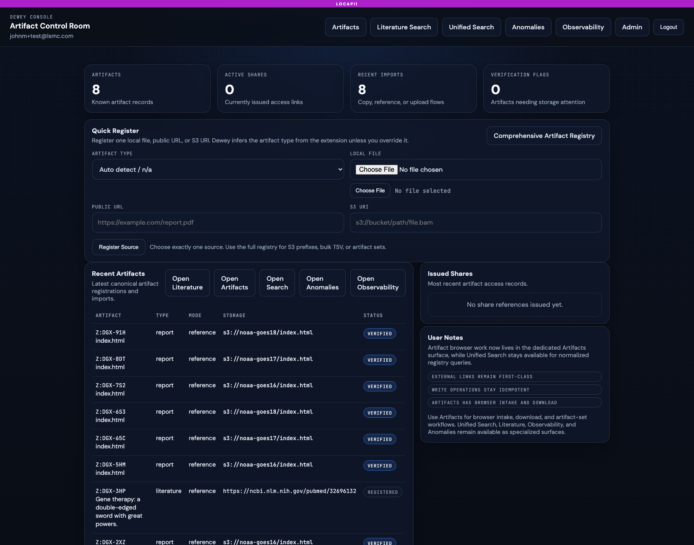
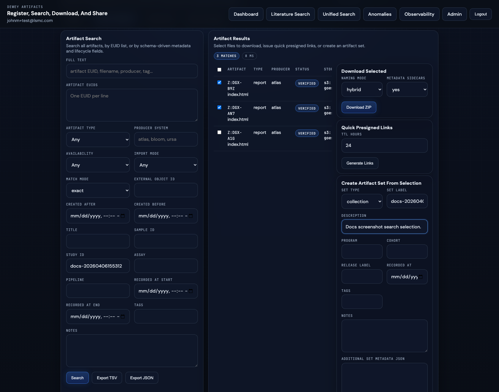
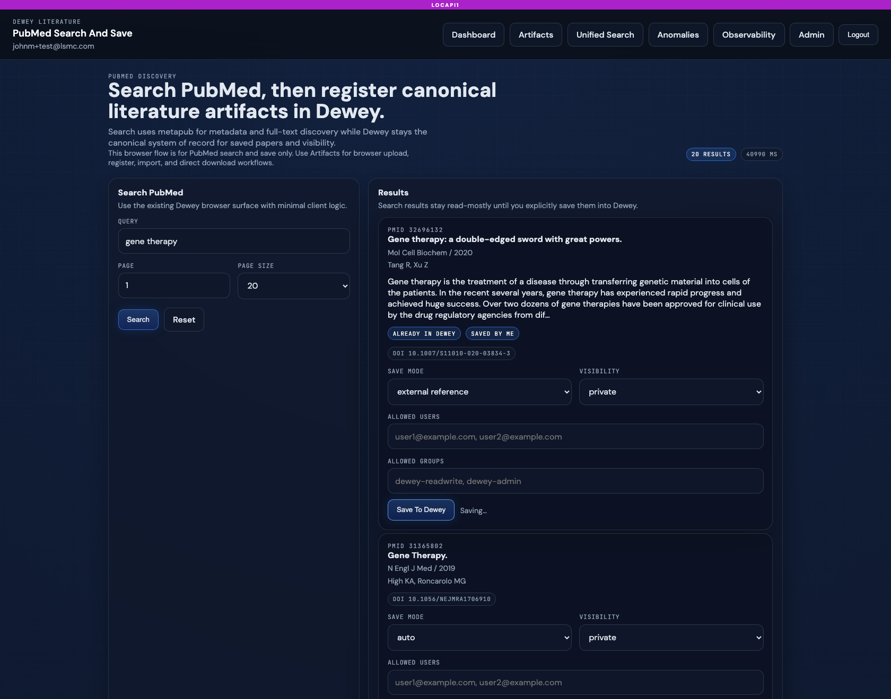
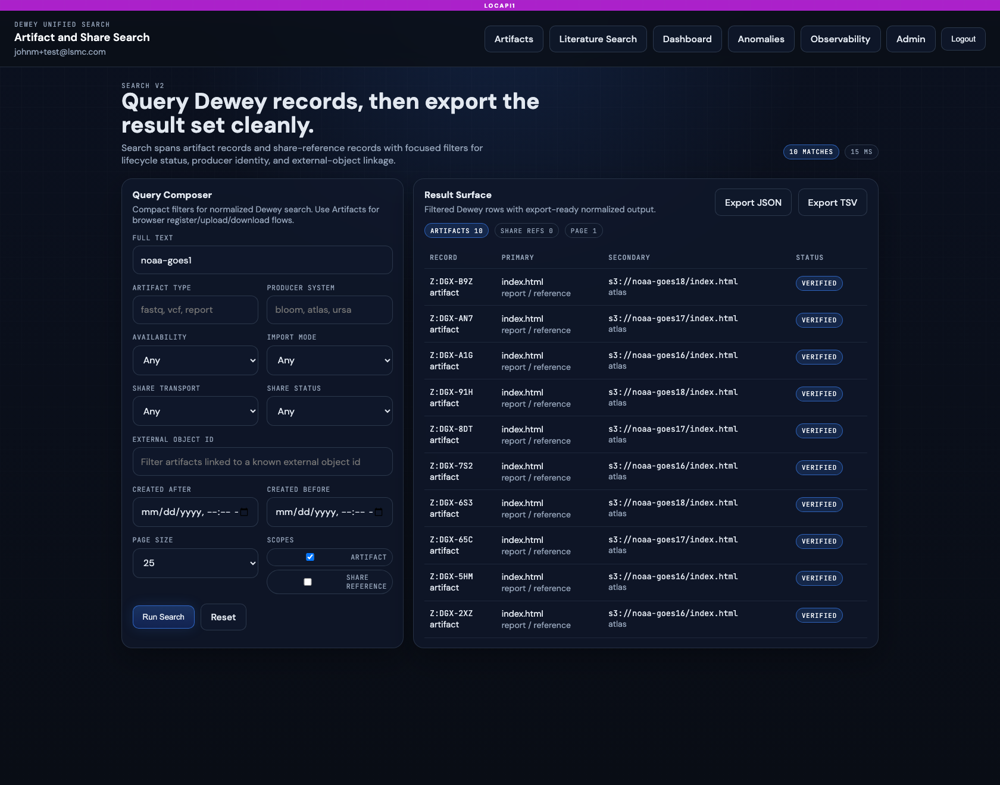

# Dewey GUI Guide

The current Dewey GUI is a small, operator-focused console layered on top of the Dewey HTTP service.

## Current Role Model

The live role enum is:

- `READ_ONLY`
- `READ_WRITE`
- `ADMIN`

The current default Cognito group mapping is:

- `platform-admin -> ADMIN`
- `dewey-admin -> ADMIN`
- `dewey-readwrite -> READ_WRITE`
- `dewey-readonly -> READ_ONLY`

Current GUI gating is still fairly coarse:

- most GUI pages require a logged-in session
- `/admin` requires an admin session
- the current browser does not yet expose a lot of fine-grained role-specific UI branching beyond admin visibility

## Dashboard

Path: `/ui`

The dashboard is the main landing page after login. It provides:

- headline metrics for artifacts, shares, recent imports, and verification flags
- quick register for one source at a time
- shortcuts into the other specialized surfaces
- recent artifacts and recent share references

Current live caveat: dashboard local-file and copy/import flows depend on the managed artifact bucket being configured. S3 reference intake remains useful even when that bucket is empty or unset.

Current screenshot:

## Artifacts

Path: `/artifacts`

The Artifacts surface is the broadest browser workflow in the repo today. It covers:

- register and upload
- directory intake
- public URL intake
- S3 URI or prefix intake
- optional artifact-set grouping during intake
- bulk TSV intake
- artifact search and export
- ZIP download with companion metadata files
- artifact sharing
- artifact-set creation, search, export, and sharing

Current live caveat: the browser can register readable existing S3 objects in `reference` mode without a managed bucket, but upload/copy-oriented flows need that bucket configured first.

This page is much broader than the dashboard quick-register form and is the best place to understand Dewey's current browser-side file handling.

Current screenshot:

## Literature Search

Path: `/literature`

The Literature Search page is purpose-built for PubMed search and save. It is not a general artifact register page.

Current live behavior:

- search PubMed through `metapub`
- show title, authors, journal, year, abstract snippet, DOI, PMCID, and best full-text link
- show whether the record is already in Dewey
- save as `auto`, `managed_artifact`, or `external_reference`
- apply `private`, `restricted`, or `all_users` visibility

Current screenshot:

## Unified Search

Path: `/search`

Unified Search is the normalized search surface for Dewey records. In the browser, it currently emphasizes artifacts and share references.

Current live filters include:

- full text
- artifact type
- producer system
- availability
- import mode
- share transport
- share status
- external object ID
- created-at range
- scopes and page size

Current screenshot:

## Anomalies

Paths:

- `/ui/anomalies`
- `/ui/anomalies/{anomaly_id}`

The anomaly UI is a read-only operator view over local anomaly records persisted in Dewey. It is focused on quick inspection rather than incident workflow management.

The current UI shows:

- severity
- status
- summary
- source view URL
- anomaly detail fields for a single record

## Observability

Path: `/ui/observability`

The Observability page shows Dewey-local telemetry only. Current sections include:

- published capability surface from `/obs_services`
- API family rollups
- endpoint rollups
- DB probe summaries
- auth-event summaries
- local anomaly snapshot

This is not a general cross-service operations console. It is Dewey's own local view of its health and activity.

## Embedded TapDB

Path: `/tapdb`

Configured Dewey deployments now mount the reusable TapDB operator UI under
`/tapdb`. This is Dewey's current reference pattern for sharing the substrate
GUI from `daylily-tapdb` directly instead of reimplementing EUID detail, search,
stats, and DAG pages inside Dewey itself.

Current live behavior:

- Dewey browser auth gates the mounted TapDB UI
- Dewey global console CSS is loaded into the mounted TapDB pages
- the mounted UI keeps TapDB's native pages such as object detail, query, info,
  and graph
- Dewey publishes the canonical root-level DAG API separately at `/api/dag/*`

## Admin

Path: `/admin`

The admin page is currently narrow and practical. It focuses on:

- recent local anomaly records
- quick anomaly review shortcuts
- managed artifact storage configuration, specifically the managed S3 bucket

At the moment, `ADMIN` access mostly affects whether this page is visible and accessible, rather than exposing a much broader separate admin console.

## Login And Logout

Paths:

- `/login`
- `/auth/login`
- `/auth/callback`
- `/auth/logout`

Current login/logout behavior is Cognito Hosted UI-backed through `daylily-cognito`. The repo's E2E browser coverage today focuses only on this login/logout path.

See:

- [../tests/e2e/README.md](../tests/e2e/README.md)

Important current test note:

- the E2E helper defaults to `https://localhost:18914`
- the normal Dewey local config and CLI defaults point to `https://localhost:8914`

Set `DEWEY_BASE_URL` explicitly when running the E2E browser flow against the standard local port.

## Current-State Caveat

The GUI described here is backed by live templates and route handlers, and the current April 6, 2026 verification run exercised those paths cleanly in a configured local deployment. The remaining caveat is operational: GUI verification still depends on a real Cognito setup and the local HTTPS endpoint being reachable.
